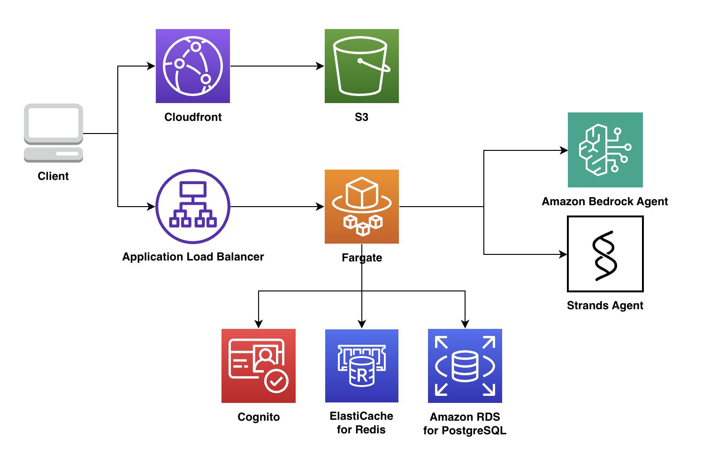

# AI Chatbot on AWS

<p align="center">
  An Open-Source AI Chatbot Template Built With Next.js and the AI SDK by Vercel. Deployed on AWS using CDK. LLM provider: AWS Bedrock.
</p>

<p align="center">
  <a href="#architecture"><strong>Architecture</strong></a> ·
  <a href="#model-providers"><strong>Model Providers</strong></a> ·
  <a href="#deploy-your-own"><strong>Deploy Your Own</strong></a> ·
  <a href="#running-locally"><strong>Running locally</strong></a>
</p>
<br/>

## Architecture



- [Next.js](https://nextjs.org) App Router
  - Advanced routing for seamless navigation and performance
  - React Server Components (RSCs) and Server Actions for server-side rendering and increased performance
- [AI SDK](https://sdk.vercel.ai/docs)
  - Unified API for generating text, structured objects, and tool calls with LLMs
  - Hooks for building dynamic chat and generative user interfaces
  - Supports xAI (default), Amazon Bedrock, OpenAI, Fireworks, and other model providers
- [Fargate](https://aws.amazon.com/fargate)
  - Container orchestration service, running API services and core business logic
  - Works with [Application Load Balancer](https://docs.aws.amazon.com/elasticloadbalancing/latest/application/introduction.html) to ensure stable streaming requests
- [shadcn/ui](https://ui.shadcn.com)
  - Styling with [Tailwind CSS](https://tailwindcss.com)
  - Component primitives from [Radix UI](https://radix-ui.com) for accessibility and flexibility
- Data Persistence
  - [Amazon RDS for PostgreSQL](https://docs.aws.amazon.com/AmazonRDS/latest/UserGuide/CHAP_PostgreSQL.html) for saving chat history and user data
  - [Amazon S3](https://docs.aws.amazon.com/AmazonS3/latest/userguide/Welcome.html) for efficient file storage
- Content delivery
  - [Amazon CloudFront](https://docs.aws.amazon.com/cloudfront/) for caching and content delivery
- [Auth.js](https://authjs.dev)
  - [Amazon Cognito](https://docs.aws.amazon.com/cognito/) for user management and authentication

## Model Providers

This template ships with [Amazon Bedrock](https://docs.aws.amazon.com/bedrock/) `Claude 3.5 Haiku, Anthropic` as the default chat model. However, with the [AI SDK](https://sdk.vercel.ai/docs), you can switch LLM providers to [OpenAI](https://openai.com), [Anthropic](https://anthropic.com), [Cohere](https://cohere.com/), and [many more](https://sdk.vercel.ai/providers/ai-sdk-providers) with just a few lines of code.

## Deploy Your Own

**Step 1.** Install the project dependencies and build the project.

```bash
sudo npm install -g pnpm
pnpm install && pnpm projen && pnpm build
```

**Step 2.** Once done, run the configuration command to help you set up the solution with the features you need:

```bash
npm run config
```

You need to provide an administrator's `email`.

When done, answer `Y` to create or update your configuration.

Your configuration is now stored under `src/config.json`. You can re-run the `npm run config` command as needed to update your `config.json`

**Step 3.** AWS CDK deploy on the target account and region

You can now deploy by running:

```bash
pnpm run deploy
```

## Running locally

Goto the folder: `src/portal`, run script:

```shell
./dev.sh [-p <AWS_PROFILE>] [-r <AWS_REGION>]
```

Your app should now be running on [localhost:3000](http://localhost:3000).


### Connecting to an Amazon RDS for PostgreSQL from outside an Amazon VPC

Amazon RDS for PostgreSQL instance are deployed within an Amazon Virtual Private Cloud (Amazon VPC). They can be accessed directly by Amazon EC2 instances or other AWS services that are deployed in the same Amazon VPC. Additionally, Amazon DocumentDB can be accessed by EC2 instances or other AWS services in different VPCs in the same AWS Region or other Regions via VPC peering.

[Connecting to an Amazon PostgreSQL DB instance from outside an Amazon VPC](https://docs.aws.amazon.com/AmazonRDS/latest/UserGuide/CHAP_GettingStarted.CreatingConnecting.PostgreSQL.html#CHAP_GettingStarted.Connecting.PostgreSQL)

### Create a tunnel to the Amazon RDS for PostgreSQL instance

For example, you might need to add -i for identity file or other SSH options

```
ssh -i "xxx.pem" -L $LOCAL_PORT:$POSTGRES_HOST:$POSTGRES_PORT user@bastion-host -N
```

- `LOCAL_PORT`: The port on your local machine that you want to use to connect to the database.
- `POSTGRES_HOST`: The hostname of the Amazon RDS for PostgreSQL instance.
- `POSTGRES_PORT`: The port on which the Amazon RDS for PostgreSQL instance is listening (default is 5432).
- `user`: The username you use to connect to the bastion host.
- `bastion-host`: The public IP address or hostname of the bastion host.

